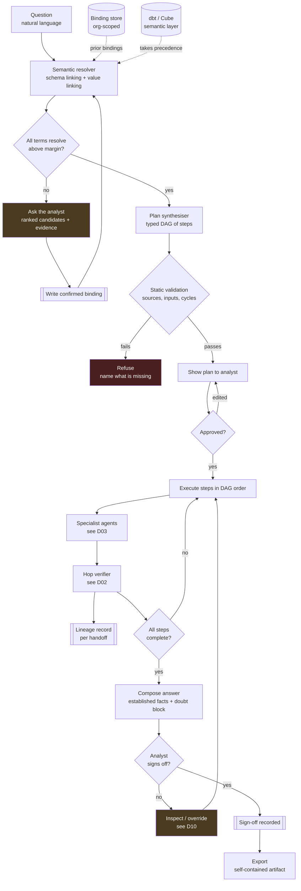

# D01 — Investigation pipeline, end to end

## What a reviewer should notice

**1. Both approval gates sit before execution, not after.** The `AMB` clarification gate and the `APPR` plan gate both fire before a single query runs. This is the architecture's answer to error compounding: it is far cheaper to catch a wrong plan by reading it than to detect a wrong answer after six hops have executed. In the beachhead journey this catches an over-broad fetch in fifteen seconds.

**2. The resolver loop writes back.** `ASK → CONF → RES` is not a retry — it deposits a confirmed binding into the org-scoped store first, so the same clarification is never asked twice. This is the only compounding mechanism in the system, and it is the data-model form of the flywheel in [product/PRD.md](../../product/PRD.md) §6.

**3. Semantic layers enter as an override, not a hint.** `SL -.->|takes precedence| RES` is a hard precedence rule: where a dbt or Cube definition exists, it wins outright `[S66]`. This is P6 in one edge — consume a semantic layer when present, never require one.

**4. Refusal is a first-class terminal state.** `VAL → REFUSE` exists because a plan that cannot be validated must not degrade into a partial plan executed hopefully. "I cannot answer this with your connected sources" is a correct output.

**5. Sign-off gates export, not answer.** The answer is produced regardless; what sign-off controls is whether it can leave. This is the mechanism that serves the low edge without selling to it — Marcus gets his answer in 90 seconds and cannot put it on a slide unreviewed ([product/journeys/edge_low.md](../../product/journeys/edge_low.md)).

## What it omits

The verification detail inside `VER` (D02), the agent structure inside `AGENTS` (D03), and every failure path that does not reach a terminal state. It is the happy path plus its three refusal branches.
