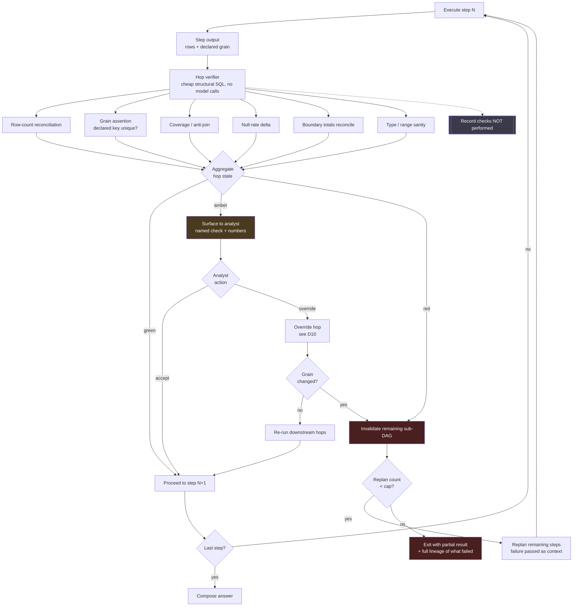

# D02 — The verify-and-replan closed loop

**What this is** — The per-hop verification loop: six structural checks, the amber and red branches, replanning, and the partial-result exit.
**Why it exists** — The differentiator rests on catching failures between hops rather than after them. This is where that claim becomes a mechanism a reviewer can check, and where the residual risk it cannot cover is drawn explicitly rather than omitted.
**How to read it** — The `NOTCHK` node and the `GRAIN` branch carry the honesty. A skeptic should attack the residual named at the foot of the page.
**Depends on / feeds** — Hop verifier from [deep_dives.md](../deep_dives.md) §4; sits inside `VER` in [D01](D01_investigation_pipeline.md).

## What a reviewer should notice

**1. No model calls in the verification path.** `CHK` and its six children are declarative SQL against the same source. This is P7, and it is the whole point: a model asked to check its own output shares the failure mode that produced the output. Databricks arrived at the same conclusion independently — *Inspect* authors smaller SQL statements to verify specific aspects of a generated query `[S32]`. It also means verification is nearly free in cost terms (D05).

**2. The replan loop is capped, and the exit is a partial result rather than a synthesis.** `CAP → PARTIAL` exists because an uncapped replanning loop under a ≈15% success rate `[S4]` is a machine for producing confident nonsense. **A partial investigation with honest lineage of what failed is a better product than a complete-looking answer assembled from three failed attempts.**

**3. `GRAIN` is the honest branch.** When an override changes the grain, downstream assumptions do not survive, so the diagram routes to `INV` and replans rather than pretending `REFLOW` is safe. This is the failure mode flagged in [features_flagship.md](../../product/features_flagship.md) #17 and specified in [ux_spec.md](../../product/ux_spec.md) §8 — drawn here so it cannot quietly degrade into "re-run everything and hope."

**4. The not-performed list is a durable write.** `NOTCHK` records which checks were skipped — because a check that was too expensive to run and is not disclosed is a false reassurance. A green hop state means *"these named checks passed"*, never *"this step is correct"*, and that distinction only survives if the unchecked set is visible.

**5. Amber goes to a human; only red replans automatically.** Coverage anomalies are usually *findings about the data* rather than *errors in the plan* — the journey's 8% region-code mismatch was a real property of the CSV, not a planning mistake. Auto-replanning on amber would erase exactly the information the analyst needs.

## The residual risk this diagram cannot draw

**Every check passes and the answer is wrong.** A join at the right cardinality and the wrong semantic grain produces no count anomaly, no null spike and no coverage gap. P3 says this plausible-looking class is the dangerous one `[S2]`, and none of `C1`–`C6` sees it.

The only defences are upstream (the shown plan, D01) and downstream (the analyst's own inspection, D10). **The whitepaper's discount of this mechanism from an observed 6.7× to a claimed 4.0× is precisely this uncertainty priced in**, and the seeded-error test set exists to replace the judgement with a number.
