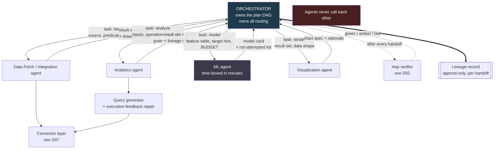

# D03 — Multi-agent orchestration

**What this is** — The star topology: one Orchestrator, four specialist agents, and the handoff contracts between them.
**Why it exists** — Multi-agent is the phrase in this pack most likely to be taken on trust. This diagram makes the structural claim checkable, and declines the broader claim that four agents beat one tool-calling loop, which no evidence here supports.
**How to read it** — Notice what is absent: there are no agent-to-agent edges. A skeptic should attack the four-agent decomposition itself.
**Depends on / feeds** — Agents from [product/PRD.md](../../product/PRD.md) §5; expands `AGENTS` in [D01](D01_investigation_pipeline.md).

## What a reviewer should notice

**1. The agents never call each other. Every handoff goes through the Orchestrator.** This is the most consequential structural decision in the system and the one most often gotten wrong. A star topology rather than a mesh means: there is exactly one place the plan lives, exactly one place lineage is appended, and exactly one place verification fires. In a mesh, a fetch agent calling an analytics agent directly produces a handoff nobody recorded — and an unrecorded handoff is a hole in the differentiator.

It also bounds the failure surface. Error propagation is the primary reliability bottleneck in agent systems `[S10]`, and a star topology means every propagation path passes a checkpoint.

**2. Each task contract carries an *expected grain*, and each result carries an *actual grain*.** That pairing is what makes D02's grain assertion possible. Agents that return untyped results make verification impossible, so the contract is where verifiability is designed in — not the verifier.

**3. The ML agent's contract carries a BUDGET parameter.** Drawn explicitly because P9 is the principle this layer is most likely to break. MLE-bench's 36.4% medal rate runs on a 12-hour budget `[S9]`; the budget in this contract is minutes, and the agent's obligation is to return what it did *not* have time to try. **The parameter is in the diagram so the constraint cannot be forgotten in implementation.**

**4. Verification is drawn as a control edge, not a pipeline stage.** `ORCH -.-> VER -.-> ORCH` fires after every handoff regardless of agent type. Making it a stage in the pipeline would let a step type opt out; making it the Orchestrator's reflex means it cannot.

**5. Lineage is a double-line edge from the Orchestrator only.** One writer, append-only. If agents wrote lineage independently, a partial failure could produce an inconsistent record — and an investigation whose record cannot be trusted is worse than no record.

## Why four agents, and the honest note about it

The four-agent decomposition — fetch, analytics, visualization, ML — comes from [BRIEF.md](../../BRIEF.md) and is **integrated breadth chosen knowingly over a single sharp differentiator** (ASSUMPTIONS A2). This diagram does not argue that four agents are better than one well-structured tool-calling loop, because that argument is not available: nothing in [research/](../../research/) establishes that a multi-agent decomposition outperforms a single agent with the same tools on this task class.

What the decomposition does buy is **legible handoffs**, and legible handoffs are what the lineage claim rests on. That is a real argument and a narrower one than "multi-agent is better." Any narrative artifact that upgrades it to the broader claim is manufacturing the 10x A2 forbids.

## What it omits

Failure and retry paths (D02), model routing per agent (D05), and the connector internals (D07).
