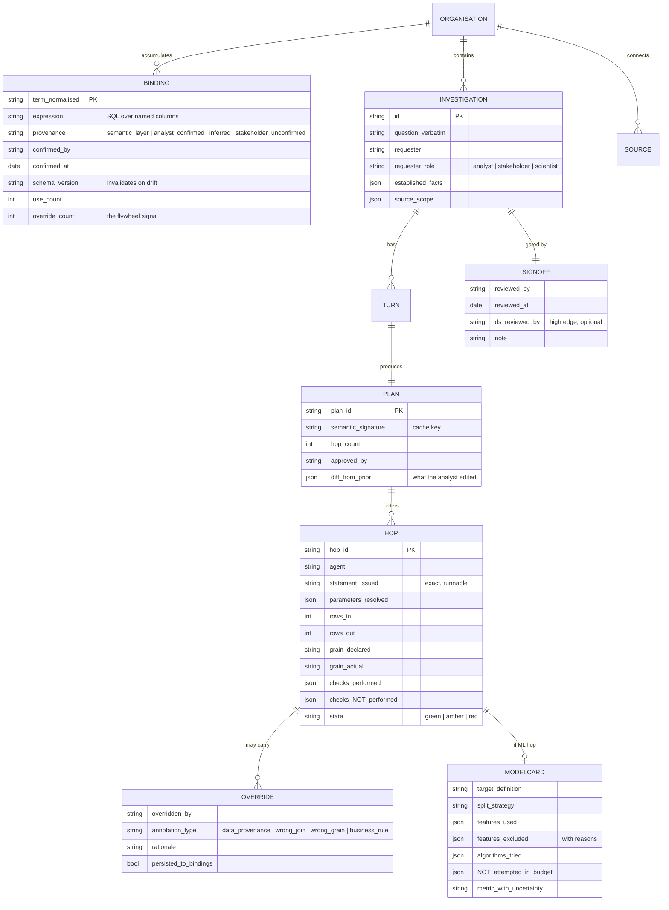

# D04 — Durable record and binding store

**What this is** — The durable record: what persists per organisation across investigations, and with what provenance.
**Why it exists** — The learning flywheel is asserted in three artifacts and is only real if the data model captures it. This is where compounding becomes columns, including the one column that could falsify the moat candidate.
**How to read it** — `override_count`, `provenance` and the two `NOT_` fields carry the argument. A skeptic should attack whether these are sufficient to evidence compounding.
**Depends on / feeds** — Flywheel from [product/PRD.md](../../product/PRD.md) §6; read by [D08](D08_evaluation_harness.md).

## What a reviewer should notice

**1. `override_count` on BINDING is the only observable evidence for the moat candidate.** ASSUMPTIONS A3 declines to claim a moat and names the confirming observation: repeat users' answer-acceptance rate rising over time with no model change. **This column, trended per source, is that observation.** If override rate does not fall as bindings accumulate, the learned-semantic-layer hypothesis is false and the pack was right not to claim it. It is drawn into the schema so the data to falsify it exists from day one rather than being retrofitted.

**2. `provenance` on BINDING has four values, and they are not interchangeable.** A definition from a dbt layer carries the organisation's authority `[S66]`; an analyst confirmation carries theirs; an inferred binding carries none; and `stakeholder_unconfirmed` is what Marcus produces when he answers a clarification ([product/journeys/edge_low.md](../../product/journeys/edge_low.md) beat 4) — stored, honoured for his own question, and **not promoted to organisational truth until an analyst agrees.** Collapsing these four into a boolean would let a non-technical user's guess silently become the company's definition of a metric.

**3. `checks_NOT_performed` is a stored column, not a runtime detail.** A skipped check that is not recorded is a false reassurance, and it must survive into the exported artifact. Storing it makes the omission auditable months later.

**4. `NOT_attempted_in_budget` on MODELCARD is likewise a first-class field.** P9's credibility mechanism is durable, not a UI string. Dr. Chen's stopping condition is an omission here ([product/journeys/edge_high.md](../../product/journeys/edge_high.md) §7.1), so the field must be populated by the modelling agent rather than composed for display.

**5. `annotation_type` on OVERRIDE separates two different facts.** *Wrong join* means the system erred. *Data provenance* means the world changed in a way no schema records — Dr. Chen's April ticketing migration. **Only the first should teach the system a lesson about its own reasoning; both should persist as organisational knowledge.** Without the distinction, a data-migration annotation would be recorded as a planning failure and would corrupt any future quality metric.

**6. `schema_version` invalidates bindings on drift.** Execution accuracy drops up to 24 points under schema evolution `[S2]`. This column is that failure made detectable: a binding whose schema version no longer matches renders struck-through rather than resolving silently to a column that has changed meaning.

**7. `diff_from_prior` on PLAN records what the analyst edited.** Rejected and corrected plans are higher-signal training data than accepted ones, and they are the only record of where the planner is systematically wrong.

## What does not persist

- **Result sets.** Only counts, schemas and samples. Full outputs are re-derivable from `statement_issued`, and a re-run against current data is the point (D02).
- **Credentials.** `parameters_resolved` never contains secrets.
- **Anything cross-organisation.** The whole graph is org-scoped, which is automatic under the self-hosted model (A5) and must remain true if a managed option is ever added.
