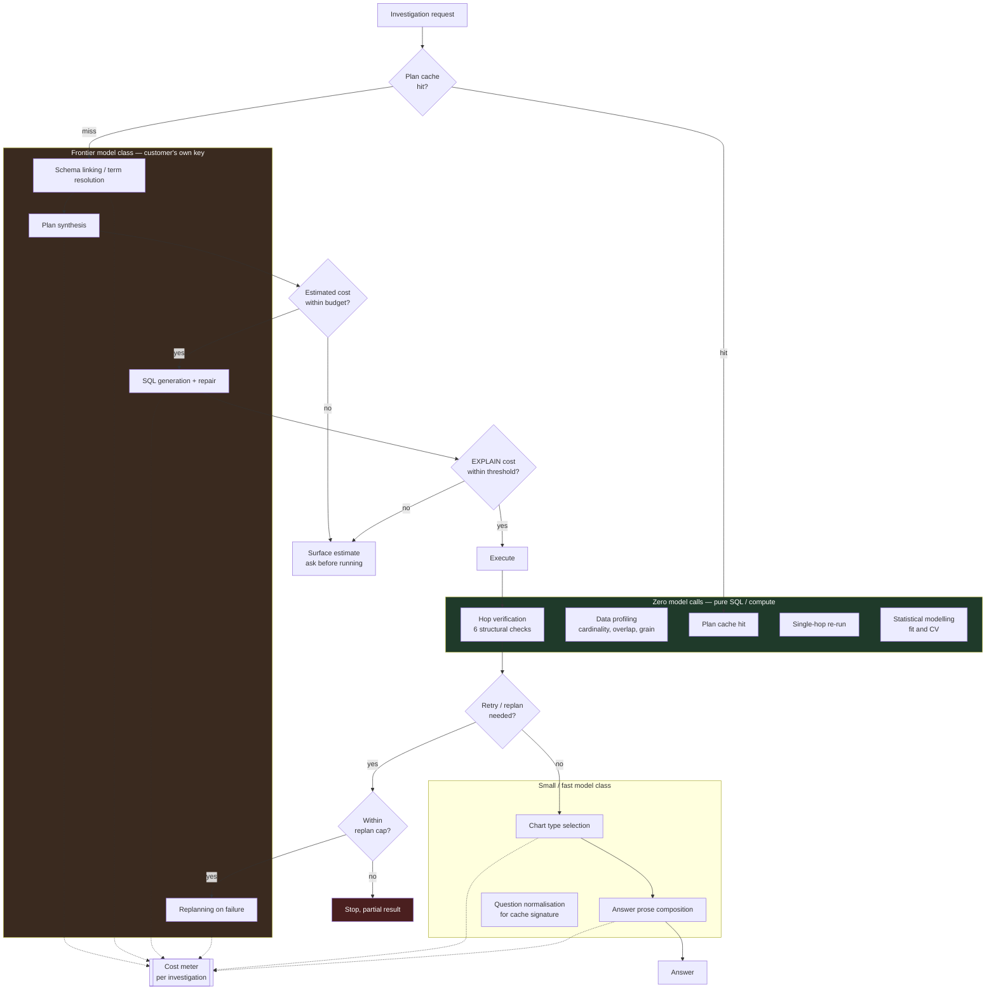

# D05 — Model routing and cost control

## What a reviewer should notice

**1. Verification costs nothing in model tokens.** The entire green block runs as SQL against the customer's own warehouse. This is the economic consequence of P7's design choice, and it matters commercially: **the differentiating mechanism is the cheapest thing in the system.** A verification approach built on model self-critique would have made the differentiator scale linearly with token price; this one scales with warehouse compute, which the customer already pays for.

**2. Statistical modelling is also in the zero-model-call block.** The ML agent uses a frontier model to *decide what to model* and then fits gradient-boosted trees and regularised linear models with ordinary libraries. It is not a model generating predictions — it is a model choosing an estimator. That distinction keeps the cost bounded and is why a minutes-long budget is feasible at all.

**3. Four cost guards, at different granularities.** Plan cache (avoid the call), budget estimate before execution (avoid the surprise), `EXPLAIN` threshold before each query (avoid the runaway warehouse bill), and the replan cap (avoid the infinite loop). **The replan cap is a cost guard as much as a correctness guard** — under a ≈15% hard-task success rate `[S4]`, uncapped replanning is expensive as well as useless.

**4. The frontier block runs on the customer's own key.** ASSUMPTIONS A5. Two consequences: cost lands on the customer's provider bill rather than in a hosted margin, and the **"self-hostable" claim explicitly does not mean small local models** — tool-initialisation failure is catastrophic in small models, 89% in qwen2.5:3b `[S11]`. This block is where that constraint binds.

**5. The cost meter is per *investigation*, not per token or per seat.** That is the brief's unit of value, and it matches how the market already prices: Cortex Analyst bills per message on success at ≈$0.134 `[S38][S39]`, and ThoughtSpot caps Spotter at 25 queries per user per month `[S44]`. The meter feeds B1 in [product/PRD.md](../../product/PRD.md) §7.3 and the `financials/` unit-economics model.

## The cost shape, and the honest uncertainty

An investigation's model cost is dominated by **plan synthesis and SQL generation, multiplied by the retry count.** The retry count is the term nobody can currently estimate, because it depends on the planner's success rate on real schemas — the ≈14.55–16% DABstep Hard figure `[S4]` implies retries are the common case, not the exception.

**A cost model that assumes one clean pass per investigation will be wrong by a large multiple.** The `financials/` layer must model cost as *cost per attempt × expected attempts*, and expected attempts is a number the 295A spike produces rather than one this document can supply.

Inference prices fall unevenly — a fixed benchmark score went from ≈$60 to ≈$0.06 per million tokens between late 2021 and late 2024 `[S63]`, with per-year declines ranging 9×–900× by capability milestone `[S64]`. That trend helps, and it is not a substitute for measuring the retry count.
