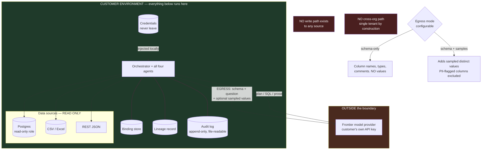

# D06 — Security and the trust boundary

**What this is** — The trust boundary: everything inside the customer environment, and the single egress that leaves it.
**Why it exists** — The platform lead can end a deal without attending a meeting, and he is convinced by artifacts rather than conversation. This diagram is that artifact, and it is what makes the neutrality claim a property rather than an assertion.
**How to read it** — Count the arrows crossing the boundary. A skeptic should attack the egress mode, which is a disclosed tradeoff rather than a solved problem.
**Depends on / feeds** — Deployment decision from [ASSUMPTIONS.md](../../ASSUMPTIONS.md) A5; satisfies the veto in [validation/decision_making_unit.md](../../validation/decision_making_unit.md) §2.3.

## What a reviewer should notice

**1. There is exactly one egress arrow.** Everything — orchestration, agents, bindings, lineage, audit log, all source access — runs inside the customer's environment. The single crossing is to the model provider, on the customer's own API key. This is ASSUMPTIONS A5 drawn as a boundary, and it is the diagram that unblocks the sale: Tom's veto is asymmetric, costs nothing to exercise, and ends the process ([strategy/sales_roadmap.md](../../strategy/sales_roadmap.md) §2).

**2. The egress is configurable down to schema-only.** `MODE` is the answer to Tom's second question — *what exactly leaves?* Schema-only sends column names, types and comments; the richer mode adds sampled distinct values, which materially improves value-based schema linking (deep dive §1) at the cost of sending data. **The tradeoff is stated and handed to the customer rather than decided for them.** PII-flagged columns are excluded from both modes.

**3. No write path exists — not disabled, absent.** PRD non-goal 4. The distinction matters to a security reviewer: a disabled feature is a configuration away from enabled, and a missing one is not. Combined with a read-only database role, the blast radius of a total compromise of this system is *what the analyst could already read*.

**4. Authorisation is inherited, never re-implemented.** The system connects under a role the customer provisions; row- and column-level permissions come from the source. Re-implementing authorisation inside an analytics tool is how such a tool becomes a data breach, and the architecture declines to try.

**5. The audit log is file-readable without the application running.** Tom's quarterly review took 8 minutes against 1.5 days for a comparable tool ([product/journeys/day_in_life.md](../../product/journeys/day_in_life.md) 07:50), and that gain depends entirely on his being able to `grep` a file rather than query a UI. Gartner attributes half of projected 2030 agent deployment failures to insufficient governance runtime enforcement `[S29]` — a readable log is the cheapest available form of that enforcement.

**6. Single-tenant by construction, not by policy.** There is no cross-organisation path to secure because there is no multi-tenant control plane. The flywheel's learning is org-scoped automatically (D04). **If a managed offering is ever added, this property is lost and must be re-earned** — which is a reason the A5 decision and the A11 neutrality argument had to be made together.

## What this diagram does not claim

- **Not a compliance certification.** No SOC 2, no HIPAA, no FedRAMP. The architecture is *compatible* with a customer's existing controls; it does not carry its own attestations, and any narrative artifact implying otherwise is wrong.
- **It does not secure the model provider.** Whatever is sent under `MODE` is subject to that provider's terms. The system's contribution is making the egress minimal, explicit and configurable — not making it zero.
- **It does not protect against a malicious analyst.** Someone with read access to the sources can already read them. This system logs what they asked, which is more accountability than they had before, and it is not a control.
