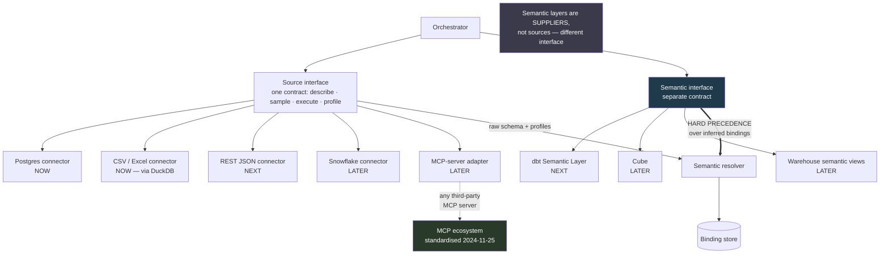

# D07 — Connectors and semantic-layer integration

**What this is** — Two separate interfaces: sources that hold data, and semantic layers that hold meaning.
**Why it exists** — Collapsing these into one connector abstraction is the natural engineering instinct, and it would forfeit the answer to the buyer’s hardest objection. The diagram exists to fix the precedence rule before it is implemented away.
**How to read it** — The doubled arrow is a hard override, not a hint. A skeptic should attack the dependency on artifacts the customer maintains for another vendor.
**Depends on / feeds** — Principle P6 from [product/PRD.md](../../product/PRD.md) §3; tested by [validation/experiment_board.md](../../validation/experiment_board.md) E9.

## What a reviewer should notice

**1. Two interfaces, not one — and this is the diagram's whole argument.** A source answers *what data exists and what does it contain*. A semantic layer answers *what does this business term mean*. Collapsing them into one connector abstraction would be the natural engineering instinct and it would be wrong: it would make a dbt layer just another source to query, when its actual role is to **override** what the system would otherwise infer.

**2. The precedence edge is doubled deliberately.** `SEM ==> RES` is a hard override, not a hint or a tiebreak. Where an organisation has defined `active_customer` in dbt, that definition wins outright over anything the resolver would infer from schema `[S66]`. This is P6 expressed structurally, and it is the mechanism behind the answer to the buyer objection that ends deals — *"I'm already buying a semantic layer for exactly this"* ([strategy/personas.md](../../strategy/personas.md) §5). The answer is: **we consume yours, we do not replace it.**

**3. The source interface is four methods, and `profile` is the non-obvious one.** `describe` and `execute` are what any connector has. `sample` supports value-based schema linking. **`profile` — cardinality, uniqueness, value distribution, overlap — is what makes the cross-source reconciler possible** (deep dive §5), and it is why the interface is not simply "run this SQL." A connector that cannot profile cannot participate in a cross-source join safely.

**4. MCP is an adapter behind the same interface, not the interface itself.** MCP standardised tool *access* — announced 2024-11-25, adopted by OpenAI, Google, Microsoft and AWS within thirteen months, donated to the Linux Foundation in December 2025 `[S62]`. It does not standardise *semantics* `[S65]`. Treating MCP as the source interface would inherit that gap; treating it as one adapter among several lets the system ride the ecosystem without depending on it for the part it does not solve.

**5. The tier labels are the actual build order.** Postgres and CSV are the 295A scope; REST and dbt are 295B; Snowflake, Cube and MCP are post-capstone. This matches [features_prioritized.md](../../product/features_prioritized.md) and is drawn here so the diagram cannot be read as describing a system that exists.

## The strategic tension this diagram contains

Consuming semantic layers is simultaneously **the highest-leverage integration available** and a deepening dependence on artifacts the customer maintains for someone else's product ([strategy/business_model_canvas.md](../../strategy/business_model_canvas.md) row 8).

The bet is that this is the right trade: a product that *requires* a semantic layer inherits the incumbents' bounded-scope failure (P6), while one that *uses one when present* gets the correctness benefit without the requirement. The `SI --> RES` edge alongside `SEM ==> RES` is exactly that — **the system works with raw schema alone and works better with a semantic layer.**

**The open question this diagram cannot settle:** how much does consuming a dbt layer actually improve accuracy? It is an A/B test on one question set with and without the layer attached, and it decides whether P6 belongs at the centre of the roadmap or the edge of it.
