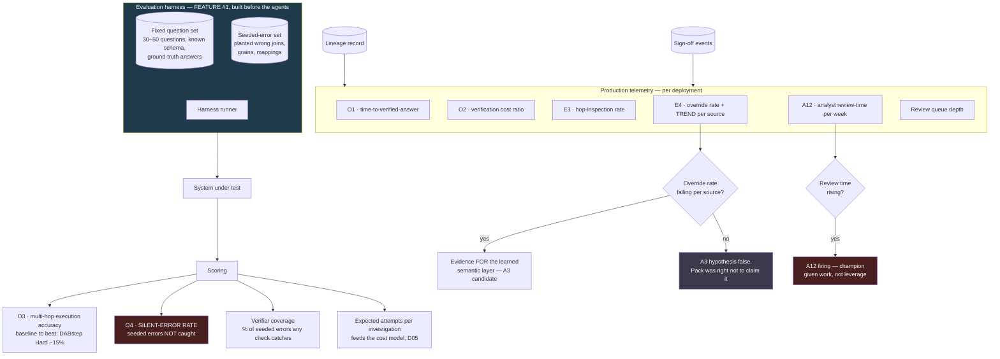

# D08 — Evaluation, observability and safety monitoring

**What this is** — The measurement system: the fixed question set, the seeded-error set, the four harness outputs, and the production telemetry derived from lineage.
**Why it exists** — This is feature #1, built before any agent, and the diagram exists to make that ordering legible. It also draws the negative outcomes as legitimate terminal states, because a measurement system that can only confirm its own hypothesis is not one.
**How to read it** — The two decision diamonds are falsifiers, not milestones. A skeptic should attack what the harness cannot measure.
**Depends on / feeds** — Metrics from [product/PRD.md](../../product/PRD.md) §7; drives [validation/experiment_board.md](../../validation/experiment_board.md) E6 and E7.

## What a reviewer should notice

**1. The harness is feature #1, built before any agent.** This is the ordering decision in [features_prioritized.md](../../product/features_prioritized.md) drawn as a system: it exists because P10 says multi-hop data reasoning is the field's weakest measured capability `[S4]`, and a project that builds four agents before it can measure anything has no way to tell whether it is working. It is also the pack's only publishable artifact — **no commercial agentic-BI product publishes an accuracy figure** ([research/sources.md](../../research/sources.md), *Named gaps* 2).

**2. O4, the silent-error rate, is the metric that matters most and is drawn in red.** It measures seeded errors the system did *not* catch. This is the only direct instrument for P3 — failure looks plausible `[S2]` — and it cannot be measured by observation, because a silent error looks exactly like a correct answer. **It requires deliberately planted faults, which is why the seeded-error set is feature #2 and not an afterthought.**

**3. Verifier coverage is a harness output, and it is what the whitepaper is missing.** [whitepaper.md](../whitepaper.md) §2.3 discounts the reconciliation mechanism from an observed 6.7× to a claimed 4.0× purely on judgement, because coverage of the plausible-failure space is unmeasured. `COV` is the number that replaces the judgement. Until it exists, the whitepaper's largest soft number stays soft.

**4. `RETRY` closes the loop with the cost model.** D05 notes that an investigation's cost is dominated by plan synthesis × retry count, and that retry count is currently unestimable. The harness produces it as a byproduct of running the question set, and it is the input `financials/` needs to model cost per investigation honestly.

**5. Two production metrics are drawn as decision diamonds, because both can falsify a claim in the pack.**
   - `FLY` — if override rate does not fall per source as bindings accumulate, the learned-semantic-layer moat candidate is false. **The diagram draws the negative outcome as a legitimate terminal state**, labelled with the fact that ASSUMPTIONS A3 declined to claim it. A system that can only confirm its own hypothesis is not an evaluation system.
   - `A12` — if analyst review time rises, the risk raised in phase 3 is firing: the champion has been given work while everyone around them got leverage ([product/journeys/day_in_life.md](../../product/journeys/day_in_life.md) §3). Review queue depth is its leading indicator.

**6. Production telemetry is derived from the lineage record, not from separate instrumentation.** O1, O2, E3 and E4 are all computable from what D04 already stores. That is a design economy — the differentiator's substrate is also the observability substrate — and it means the metrics cannot drift out of sync with what actually happened.

## The measurement this diagram cannot provide

**O2 — the verification cost ratio — cannot come from the harness.** It requires humans: the same question under two conditions, timed, with real analysts. It is the claim the whole pack rests on ([whitepaper.md](../whitepaper.md) §2.4) and the harness has nothing to say about it.

That belongs to the validation layer, and the diagram shows O2 arriving from production telemetry rather than from `SCORE` for exactly that reason. **A pack that could measure everything in a harness would not need customers, which would be a warning sign rather than a strength.**
