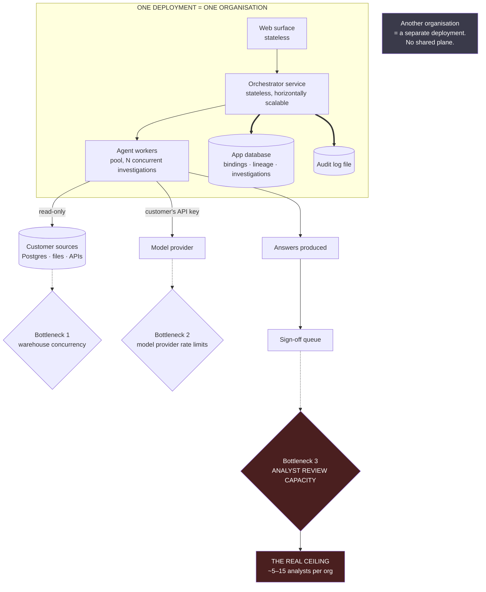

# D09 — Deployment topology and where scale actually binds

## What a reviewer should notice

**1. The system's scaling story is boring, and that is correct.** Stateless web and orchestrator tiers, a worker pool, one application database. Nothing here is novel and nothing needs to be. ASSUMPTIONS A5 makes each deployment single-tenant, which removes the entire class of problems — noisy neighbours, tenant isolation, cross-tenant data leakage, per-tenant rate limiting — that would otherwise dominate this diagram.

**2. The honest scale question is not requests per second.** A realistic deployment serves **5–15 analysts** ([strategy/channel_plan.md](../../strategy/channel_plan.md) §1), each running perhaps a few investigations a day. That is single-digit concurrent investigations. **The engineering problem is latency and correctness per investigation, not throughput**, and a diagram claiming otherwise would be describing a product that does not exist.

**3. Three bottlenecks, and the third is the one that matters.** Warehouse concurrency and model rate limits are real and both have ordinary mitigations — query cost guards (D05), backoff, a bounded worker pool. **Bottleneck 3 is not an engineering constraint at all: it is analyst review capacity**, and no amount of horizontal scaling touches it.

This is A12 drawn as a topology. The system can produce answers faster than analysts can sign them off, and the sign-off gate is deliberate (it is what serves the low edge without selling to it). **So the deployment's real ceiling is the review queue**, which is why D08 tracks queue depth as a leading indicator and why [ux_spec.md](../../product/ux_spec.md) §10 specifies an overload state.

**4. Scaling *out* is scaling to more organisations, which means more deployments, not a bigger one.** `DEP2` is drawn to make the consequence explicit: there is no shared control plane, so growth is a distribution problem (installs) rather than an infrastructure problem (capacity). That is consistent with the open-source self-serve channel being the only viable one at a $900 ACV ([strategy/channel_plan.md](../../strategy/channel_plan.md) §4).

**5. Nothing in this diagram is a differentiator, and it should not be presented as one.** A narrative artifact that leads with architecture diagrams like this is claiming engineering sophistication the system does not have and does not need. The interesting diagrams are D02, D03, D06 and D08.

## What the single-tenant choice costs

Named because the diagram makes it look free.

1. **No cross-organisation learning, ever.** Each deployment's binding store starts empty. The flywheel is per-organisation by construction (D04), so a hundred deployments produce a hundred separate learning curves rather than one compounding asset. **This directly caps the moat candidate in A3** — whatever accumulates is the customer's, not the company's.
2. **Upgrades are the customer's problem.** Open-core self-hosted means version fragmentation, and support burden scales with deployment count rather than with revenue.
3. **No usage telemetry by default.** The company cannot observe O1–O4 across deployments without the customer opting in to send it. Every metric in D08's production block is measurable *by the customer* and invisible to the vendor unless shared. **That is a real cost to the venture and the right default for the buyer**, and it is a tension the pack should not pretend away.
