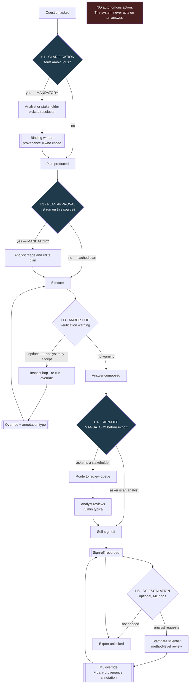

# D10 — Human-in-the-loop and escalation

**What this is** — Every point a human intervenes, by role: three mandatory gates and two optional ones.
**Why it exists** — A system whose human gates are all optional has none, because optional review is skipped under load. This diagram fixes which gates cannot be skipped, and shows that every intervention writes something durable rather than merely unblocking flow.
**How to read it** — The `H4` branch on requester role is the entire low-edge design. A skeptic should attack whether the review queue scales.
**Depends on / feeds** — Sign-off from [product/features_flagship.md](../../product/features_flagship.md) #19; the queue risk is [ASSUMPTIONS.md](../../ASSUMPTIONS.md) A12.

## What a reviewer should notice

**1. Three mandatory gates, two optional.** H1 (clarification), H2 (plan approval on first run against a source) and H4 (sign-off before export) cannot be skipped. H3 (amber hop) and H5 (DS escalation) are analyst-initiated. **A system whose human gates are all optional has no human gates** — under load, optional review is skipped, and the plausible-wrong-answer failure mode P3 describes is exactly the one that survives skipped review.

**2. H2 fires on first run per source, not per question.** This is the design's main concession to usability: demanding plan approval on every question would make the product unusable for repeat work, and never demanding it would remove the cheapest error-catching mechanism in the system. First-run-per-source plus plan caching (D05) is the compromise, and it means the gate costs an analyst once per source rather than once per question.

**3. H4 branches on *who asked*, and that branch is the entire low-edge design.** An analyst self-signs. A stakeholder's answer routes to a review queue. Marcus gets his answer in 90 seconds and cannot export it unreviewed — which converts him from someone who guesses ([research](../../research/sources.md) `[S15]`: 76% have decided without data) into someone who waits two hours for six minutes of an analyst's time. **This is how PRD non-goal 1 is enforced mechanically rather than by policy.**

**4. Every human intervention writes something durable.** H1 writes a binding with its provenance; H3 writes an override with its annotation type; H4 writes sign-off with attribution; H5 writes a method-level override. **Human effort is never spent twice on the same problem** — that is the entire flywheel argument (D04), and it is why every gate in this diagram terminates in a `[[write]]` rather than merely unblocking flow.

**5. The annotation type on H3 and H5 separates two different facts.** *Wrong join* means the system erred; *data provenance* means the world changed in a way no schema records — Dr. Chen's April ticketing migration. Only the first is evidence about the system's reasoning quality; both are organisational knowledge. Collapsing them would corrupt any quality metric built on override rate (D08's `FLY` decision).

**6. No autonomous action, anywhere.** PRD non-goal 5. The system produces answers; humans act on them. There is no alerting-into-workflow path, no triggered action, no decision executed. This bounds the blast radius of every failure mode in the pack to *a wrong answer a human read*, which is the same blast radius the analyst's own SQL already has.

## The load-bearing risk this diagram makes visible

**H4's stakeholder branch is where A12 lives.** Every stakeholder question becomes analyst review work. Three reviews at 23 minutes is fine ([product/journeys/day_in_life.md](../../product/journeys/day_in_life.md) 11:40); fifteen would recreate the bottleneck the product exists to remove, with the added insult that the analyst is now verifying instead of analysing.

Two things keep the gate viable and **both are unproven**:
1. Reviewing must be structurally cheaper than deriving — the O2 claim the whole pack rests on.
2. The flywheel must reduce future review load, observable only as override-rate trend over months (D08).

**If either fails, this diagram is where it shows first**, and the failure looks like adoption stalling at the champion. That is why review-queue depth is a first-class metric and not a UX nicety.
