# Technique decision tree — what fires, when, in what order

**What this is** — The runtime logic: which techniques from the three waves fire at which point in an investigation, what triggers each branch, and what takes priority when several conditions hold at once.
**Why it exists** — [wave1.md](wave1.md)–[wave3.md](wave3.md) are a catalogue; a catalogue does not say what happens at 4:10pm on a Thursday when a term is ambiguous *and* the plan is seven hops *and* one source has never been seen before. This file resolves those collisions. The failure it prevents: an implementation where technique selection is implicit in code order, so nobody can say why the system asked a clarifying question in one case and guessed in another.
**How to read it** — The flowchart is the shape; the logic table is the specification. A skeptic should attack the priority ordering in §2, which decides what the system does when safety, cost and progress conflict.
**Depends on / feeds** — Techniques from all three waves; loop from [product/PRD.md](../../product/PRD.md) §1.1; gates from [D10](../architecture/D10_human_in_the_loop.md). Feeds [technique_feature_matrix.md](technique_feature_matrix.md) and implementation.

---

## 1. The tree

```mermaid
flowchart TD
    START["Question received"] --> SENSE["CONTINUOUS SENSING<br/>schema state · binding coverage · source health<br/>· prior investigations · budget remaining"]

    SENSE --> T0{"TRIAGE 1<br/>Sources reachable<br/>and authorised?"}
    T0 -->|no| STOP1["REFUSE · name the unreachable source<br/>W1: 7.5 least-privilege"]
    T0 -->|yes| T1{"TRIAGE 2<br/>PII-flagged columns<br/>in scope?"}
    T1 -->|yes| REDACT["Exclude from sampling and context<br/>W1: 1.5 restricted · D06 egress mode"]
    T1 -->|no| RESOLVE
    REDACT --> RESOLVE

    RESOLVE["RESOLVE TERMS<br/>W1: 1.2 BM25 + 1.3 dense + 1.4 RRF<br/>+ 1.5 value linking · W2: 2.4.4 expansion from bindings"]

    RESOLVE --> B1{"Semantic layer<br/>defines this term?"}
    B1 -->|yes| USESEM["USE IT — hard precedence<br/>W2: 2.5.5 metric algebra"]
    B1 -->|no| B2{"Binding exists<br/>and schema_version valid?"}
    B2 -->|yes| USEBIND["Reuse confirmed binding"]
    B2 -->|"stale"| INVAL["Strike through · re-resolve<br/>W1: schema-drift detection"]
    B2 -->|no| B3{"Top-2 candidates<br/>within margin?"}
    B3 -->|yes| ASK["ASK — halt<br/>W1: 1.8 margin thresholding"]
    B3 -->|no| INFER["Bind as inferred"]

    USESEM --> PLAN
    USEBIND --> PLAN
    ASK --> PLAN
    INFER --> PLAN
    INVAL --> ASK

    PLAN["SYNTHESISE PLAN<br/>W2: 2.1.1 grammar-constrained · 2.1.2 type-directed<br/>W3: 3.1.2 plan-then-execute · 3.1.9 extended reasoning"]

    PLAN --> P1{"Static validation<br/>passes?"}
    P1 -->|no| STOP2["REFUSE · name what is missing"]
    P1 -->|yes| P2{"Hop count<br/>> ceiling?"}
    P2 -->|yes| WARN["WARN · suggest split<br/>W2: 2.2.2 compounding budget"]
    P2 -->|no| P3
    WARN --> P3
    P3{"First run against<br/>any source in plan?"}
    P3 -->|yes| APPROVE["HUMAN GATE · show plan<br/>W3: 3.2.4 pre-registration"]
    P3 -->|no| CACHE{"Plan cache hit?"}
    CACHE -->|yes| EXEC
    CACHE -->|no| APPROVE
    APPROVE --> EXEC

    EXEC["EXECUTE STEP<br/>W1: 3.5 pushdown · 3.6 LIMIT-first · 3.7 constrained decoding<br/>W1: 3.3 EXPLAIN guard"]

    EXEC --> E1{"Query<br/>errored?"}
    E1 -->|yes| REPAIR{"Repair attempts<br/>< cap?"}
    REPAIR -->|yes| FIX["W1: 3.2 execution-feedback repair"]
    FIX --> EXEC
    REPAIR -->|no| FAILHOP["Mark hop failed · record all attempts"]
    E1 -->|no| VERIFY

    VERIFY["VERIFY HOP · no model calls<br/>W1: 4.1 row counts · 4.2 grain · 4.3 boundary totals<br/>· 4.6 cardinality · 4.7 independent path<br/>W2: 2.5.4 SCD detection"]

    VERIFY --> V1{"Cross-source<br/>join in this hop?"}
    V1 -->|yes| RECON["RECONCILE<br/>W1: 2.3 Jaccard · 2.5 grain · 2.6 anti-join coverage<br/>· 2.8 normalisation · 2.9 fuzzy — PROPOSE ONLY"]
    V1 -->|no| V2
    RECON --> V2{"Hop state"}

    V2 -->|green| NEXT{"More steps?"}
    V2 -->|amber| HUMAN2["HUMAN GATE · surface named check + numbers"]
    V2 -->|red| RP{"Replan count<br/>< cap?"}

    HUMAN2 --> NEXT
    RP -->|yes| REPLAN["W3: 3.1.4 replan with failure as context"]
    REPLAN --> PLAN
    RP -->|no| PARTIAL["EXIT PARTIAL · full lineage of failure<br/>W2: 2.2.5 graceful degradation"]

    NEXT -->|yes| EXEC
    NEXT -->|no| ANALYTIC{"Question type?"}

    ANALYTIC -->|descriptive| DESC["W1: 5.1 period-over-period · 5.5 segmentation"]
    ANALYTIC -->|"diagnostic<br/>(why did X change)"| DIAG["W1: 5.2 mix vs rate · 5.4 contribution<br/>⚠ W2: 2.3.4 multiple-comparisons correction REQUIRED"]
    ANALYTIC -->|predictive| PRED["W1: 6.1/6.2 baselines · 6.3 CV · 6.4 embargoed split<br/>· 6.5 permutation importance · W2: 2.3.1 conformal<br/>BUDGET: minutes"]

    DESC --> ANS
    DIAG --> ANS
    PRED --> ANS
    ANS["COMPOSE ANSWER<br/>established facts + doubt block<br/>NEVER a confidence score — W2: 2.3.6 declined"]

    ANS --> SIGN{"Asker is<br/>an analyst?"}
    SIGN -->|yes| SELF["Self sign-off"]
    SIGN -->|no| QUEUE["Route to review queue<br/>W2: 2.6.3 priority discipline · 2.6.6 batching"]

    style STOP1 fill:#4a1f1f,color:#fff
    style STOP2 fill:#4a1f1f,color:#fff
    style PARTIAL fill:#4a1f1f,color:#fff
    style ASK fill:#4a3a1f,color:#fff
    style APPROVE fill:#4a3a1f,color:#fff
    style HUMAN2 fill:#4a3a1f,color:#fff
    style DIAG fill:#3a2a4a,color:#fff
```

## 2. Priority order when conditions collide

Evaluated top-down. The first matching rule wins, and later rules do not override it.

| Rank | Condition | Action | Why it outranks what follows |
|---|---|---|---|
| **1** | Source unreachable or unauthorised | **Refuse** | A permissions failure must never degrade into a partial answer over the subset the system happened to reach. That is the shape of a data-access incident |
| **2** | PII-flagged column in scope | **Redact before anything else** | Egress is irreversible. Redaction must precede sampling, linking and any model call (D06) |
| **3** | Budget exhausted (tokens or query cost) | **Halt and surface the estimate** | Cost failures are recoverable; a runaway warehouse bill damages the customer relationship more than a refused question |
| **4** | Term ambiguous above margin | **Ask** | Schema errors are 81.2% of failures `[S2]`. Asking costs seconds; guessing costs a plausible wrong answer the user cannot detect |
| **5** | First run against a source | **Show plan, require approval** | Cheapest possible error catch. Once per source, not once per question |
| **6** | Hop verification red | **Replan, capped; then exit partial** | An honest partial beats a synthesis assembled from failures |
| **7** | Hop verification amber | **Surface to human, continue if accepted** | Coverage anomalies are usually findings about the data, not planning errors — auto-replanning would erase the information the analyst needs |
| **8** | Hop count above ceiling | **Warn, allow** | Advisory. 95% over six hops is ≈74% `[S13]`, but a long plan the analyst has read is legitimate |
| **9** | Everything nominal | **Proceed** | — |

**The load-bearing ordering decision is 4 above 5.** Clarification fires *before* plan approval, because a plan built on a misresolved term wastes the analyst's plan-review attention on a plan that was doomed. Asking first means the plan they read is the plan worth reading.

## 3. Question-type branch — the important asymmetry

The `ANALYTIC` branch is where the three question types diverge, and they are not symmetric in risk.

| Type | Techniques | Risk profile |
|---|---|---|
| **Descriptive** — *what happened* | Period-over-period, segmentation | **Lowest risk.** Structural checks cover most failure modes |
| **Diagnostic** — *why did X change* | Mix-vs-rate decomposition, contribution analysis | **Highest risk, and under-defended.** Scanning many dimension members for "drivers" is a multiple-comparisons problem; without correction (W2 2.3.4) the system confidently names noise. **No structural check in D02 catches this** — it is a statistically wrong answer, not a mechanically wrong one |
| **Predictive** — *will it continue* | Regularised baselines, GBDT, embargoed split, permutation importance, conformal intervals | Medium risk, well-defended by human review at D10's H5 — but bounded by the minutes-long budget (P9) |

**The diagnostic branch is drawn in a distinct colour for that reason.** It is the branch a business user most wants, the branch Sisu Data commercialised `[S56]`, and the branch where this system is currently weakest. The multiple-comparisons correction is marked **REQUIRED** in the diagram rather than optional, and it is not yet implemented.

## 4. Continuous re-evaluation

Four conditions are re-checked throughout an investigation rather than once at the start:

| Signal | Re-checked | Effect when it changes |
|---|---|---|
| **Binding validity** | Every hop that uses a bound term | A schema change mid-investigation strikes the binding and forces re-resolution — the 24-point schema-evolution failure `[S2]` surfaced rather than silent |
| **Cumulative cost** | After every model call and every query | Crossing the budget halts and surfaces the estimate |
| **Compounding budget** | After each verification | Amber hops raise the estimated end-to-end error; enough of them should trigger a warning even when no hop is red |
| **Source health** | On each fetch | Circuit-break a repeatedly failing source rather than retrying into it (W2 2.2.7) |

## 5. What this tree does not decide

1. **When to give up on a question entirely** rather than exit partial. Currently governed by a fixed replan cap; whether that cap should adapt to question value is unanswered.
2. **Whether a cached plan should be re-approved after N days.** Plans cache on semantic signature plus schema version; nothing expires on time alone, and a plan approved six months ago may deserve a fresh look.
3. **How to rank multiple amber hops** when several fire at once. The doubt block ranks by severity, but severity is not yet defined beyond check type.

All three are implementation decisions the 295A spike should settle empirically rather than by argument.
